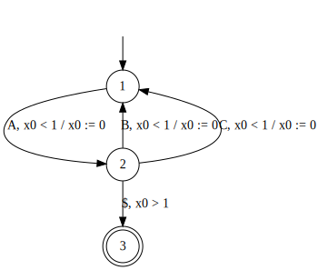

Timed Automata
==============

In this document, we show how to use MONAA to monitor a timed automata specification. We assume that you know the basics of timed automata and what MONAA does. If you have never used MONAA, we recommend to read [Getting Started](./getting_started.md).

We use the following timed word as the input. It is also in
[`example/getting_started/timed_word.txt`](../example/getting_started/timed_word.txt).

``` {.example}
A 0.5
B 0.8
C 1.5
A 2.0
B 3.2
A 3.5
C 4.6
```


DOT language
------------

In MONAA, timed automata are represented by [DOT language](https://www.graphviz.org/doc/info/lang.html) for [Graphviz](https://www.graphviz.org/doc/info/lang.html). Because we use various custom attributes to represent timed automata in DOT, it is not suitable to be visualized by Graphviz. Please consider using [visualize-monaa-dot](https://github.com/MasWag/visualize-monaa-dot) to translate to a DOT suitable for visualization.

The list of our custom attributes are as follows.

<table>
<thead>
<tr class="header">
<th></th>
<th>attribute</th>
<th>value</th>
<th>description</th>
</tr>
</thead>
<tbody>
<tr class="odd">
<td>vertex</td>
<td>init</td><td>0 or 1</td><td><tt>init=1</tt> if the state is initial</td></tr>
<tr class="even">
<td>vertex</td><td>match</td><td>0 or 1</td><td><tt>match=1</tt> if the state is accepting</td>
</tr>
<tr class="odd">
<td>edge</td><td>label</td><td>[a-z], [A-Z]</td><td>the value represents the event on the transition</td>
</tr>
<tr class="even">
<td>edge</td><td>reset</td><td>a list of integers</td><td>the set of variables reset after the transition</td>
</tr>
<tr class="odd">
<td>edge</td><td>guard</td><td>a list of inequality constraints</td><td>the guard of the transition</td>
</tr>
</tbody>
</table>

Untimed example
---------------

The following is a timed automaton equivalent to the TRE `(A(B|C))+$`.


```
digraph G {
        1 [init=1,match=0];
        2 [init=0,match=0];
        3 [init=0,match=1];
        1->2 [label=A];
        2->1 [label=B];
        2->1 [label=C];
        2->3 [label="$"];
}
```

The result of the timed pattern matching is as follows.

../build/monaa -f ../examples/TA/untimed.dot < ../examples/getting_started/timed_word.txt
```

``` {.example}
 -0.000000       <= t <   0.500000
  0.500000        < t' <=   0.800000
 -0.000000        < t' - t <=   0.800000
=============================
  1.500000       <= t <   2.000000
  2.000000        < t' <=   3.200000
 -0.000000        < t' - t <=   1.700000
=============================
  1.500000       <= t <   2.000000
  3.500000        < t' <=   4.600000
  1.500000        < t' - t <=   3.100000
=============================
  3.200000       <= t <   3.500000
  3.500000        < t' <=   4.600000
 -0.000000        < t' - t <=   1.400000
=============================
```

Timed example
-------------

We can add timing constraints to the above timed automaton. In the following example the added timing constraint is as follows.

- The initial A must occur within 1 time unit after the trimming
- Any B or C must occur within 1 time unit after the previous A
- Any non-initial A must occur within 1 time unit after the previous B or C
- The blank interval after the last B or C must be less than 1 time unit

```
digraph G {
        1 [init=1,match=0];
        2 [init=0,match=0];
        3 [init=0,match=1];
        1->2 [label=A,reset="{0}",guard="{x0 < 1}"];
        2->1 [label=B,reset="{0}",guard="{x0 < 1}"];
        2->1 [label=C,reset="{0}",guard="{x0 < 1}"];
        2->3 [label="$",guard="{x0 > 1}"];
}
```



The result of the timed pattern matching is as follows.

``` {.bash org-language="sh" results="raw"}
../build/monaa -f ../examples/TA/timed.dot < ../examples/getting_started/timed_word.txt
```

``` {.example}
  1.500000       <= t <   2.000000
  3.000000        < t' <=   3.200000
  1.000000        < t' - t <=   1.700000
=============================
  3.200000       <= t <   3.500000
  4.500000        < t' <=   4.600000
  1.000000        < t' - t <=   1.400000
=============================
```
