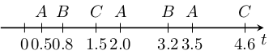
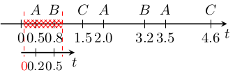

Getting Started
===============

Let\'s see an example usage of MONAA. We use timed regular expressions in
this document.

Consider the following as the input timed word. It is also in
`example/getting_started/timed_word.txt`.

``` {.example}
A 0.5
B 0.8
C 1.5
A 2.0
B 3.2
A 3.5
C 4.6
```



Your first example
------------------

Let\'s detect consecutive occurrences of the events A and B. For
example, we can use the TRE `(AB)$`. An example of the usage and the
result is as follows.

``` {.bash org-language="sh" results="raw"}
../build/monaa -e '(AB)$' < ../examples/getting_started/timed_word.txt
```

``` {.example}
 -0.000000       <= t <   0.500000
  0.800000        < t' <=   1.500000
  0.300000        < t' - t <=   1.500000
=============================
  1.500000       <= t <   2.000000
  3.200000        < t' <=   3.500000
  1.200000        < t' - t <=   2.000000
=============================
```

MONAA detects the occurrences of A and B in the following two subwords.

``` {.example}
A 0.5
B 0.8
```

``` {.example}
A 2.0
B 3.2
```

In timed pattern matching, the \`\`occurrences\'\' does not mean the
subwords but it means the trimming on an open interval. For example, the
first occurrence of AB is observed by the trimming on (0.3,1.0).
Therefore, the result of MONAA is not a set of subwords but a (possibly
infinite) set of open intervals (t,t').



The last character `$` of `(AB)$` is the end of the trimming. This is
useful when giving a constraint on t'.

Timing constraints
------------------

We can give a timing constraint on the timed words. When we want to
exclude the occurrences of A and B such that the duration between A and
B is less than 1, we can use the following TRE.

``` {.bash org-language="sh" results="raw"}
../build/monaa -e '(A(B)%(1,20))$' < ../examples/getting_started/timed_word.txt
```

``` {.example}
  1.500000       <= t <   2.000000
  3.200000        < t' <=   3.500000
  1.200000        < t' - t <=   2.000000
=============================
```

Disjunctions
------------

We can also say that the second event may be either B or C. We can use
disjunctions for such a purpose.

``` {.bash org-language="sh" results="raw"}
../build/monaa -e '(A(B|C)%(1,20))$' < ../examples/getting_started/timed_word.txt
```

``` {.example}
  1.500000       <= t <   2.000000
  3.200000        < t' <=   3.500000
  1.200000        < t' - t <=   2.000000
=============================
  3.200000       <= t <   3.500000
  4.600000        < t' <=        inf
  1.100000        < t' - t <=        inf
=============================
```
