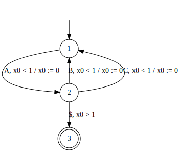

Related Tool
============

TRE2TA
------

By [tre2ta](./tre2ta_man.md), you can translate a timed regular expression to a timed automaton. You can visualize the generated timed regular expression by `visualize-monaa-dot` for example.


### Installation by Homebrew (for macOS)

1. Set up homebrew (See the [official web page](https://brew.sh))
2. Install tre2ta (and also monaa) by `brew install maswag/scientific/monaa`

### Docker

1. Install [docker](https://www.docker.com/)
2. pull the docker image by `docker pull maswag/tre2ta`.
3. Use the container e.g., `docker run -i maswag/tre2ta -e '(AB)$'`.

[Docker Hub page](https://cloud.docker.com/u/maswag/repository/docker/maswag/tre2ta)

### Installation from source

#### 1. Build tre2ta

```
cd /path/to/monaa
mkdir -p build
cd build && cmake -DCMAKE_BUILD_TYPE=Release .. && make tre2ta
```

#### 2. (Optional) Install the executable and the manual

```
sudo install -m755 tre2ta /usr/local/bin
sudo install -m644 ../doc/tre2ta.1 /usr/local/share/man/man1/
```

visualize-monaa-dot
-------------------

[Visualize-monaa-dot](https://github.com/MasWag/visualize-monaa-dot) is a tool to translate DOT file for MONAA to the DOT file suitable for visualization by Graphviz. For example, the following DOT language is visualized as the following graph through Graphviz.

```
digraph G {
        1 [init=1,match=0];
        2 [init=0,match=0];
        3 [init=0,match=1];
        1->2 [label=A,reset="{0}",guard="{x0 < 1}"];
        2->1 [label=B,reset="{0}",guard="{x0 < 1}"];
        2->1 [label=C,reset="{0}",guard="{x0 < 1}"];
        2->3 [label="$",guard="{x0 > 1}"];
}
```



Visualize-monaa-dot reads DOT for MONAA from the standard input and it outputs DOT for Graphviz to the standard output. Therefore, for example, the whole process to create an svg file (`example.svg`) from a DOT file (`example.dot`) is as follows.

```
visualize-monaa-dot-exe < example.dot | dot -T svg -o example.svg
```

Since visualize-monaa-dot uses the [graphviz](http://hackage.haskell.org/package/graphviz) package of Haskell for DOT language parsing, while MONAA uses the [Boost Graph Library](https://www.boost.org/doc/libs/1_70_0/libs/graph/doc/index.html), their supported DOT languages have slight difference.
